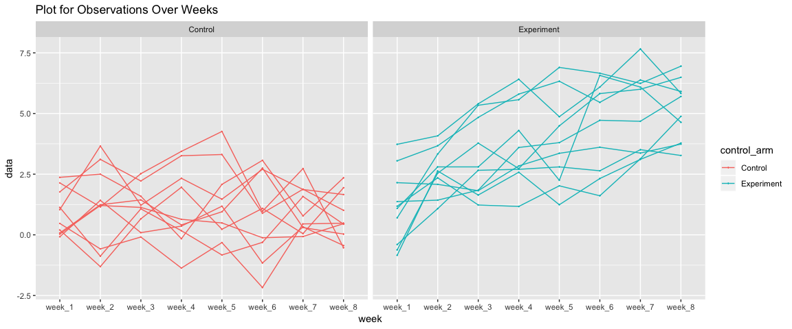
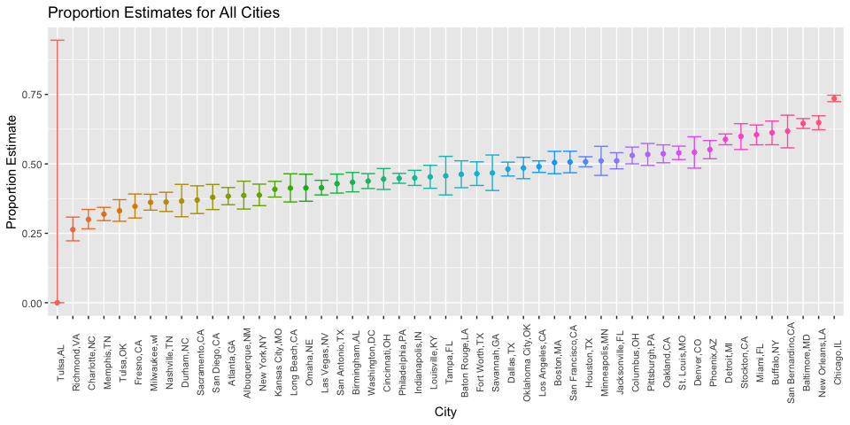

P8105\_hw5\_jl5172
================

``` r
library(tidyverse)
```

    ## ── Attaching packages ─────────────────────────────────────────────────────────────────────── tidyverse 1.2.1 ──

    ## ✔ ggplot2 3.0.0     ✔ purrr   0.2.5
    ## ✔ tibble  1.4.2     ✔ dplyr   0.7.6
    ## ✔ tidyr   0.8.1     ✔ stringr 1.3.1
    ## ✔ readr   1.1.1     ✔ forcats 0.3.0

    ## ── Conflicts ────────────────────────────────────────────────────────────────────────── tidyverse_conflicts() ──
    ## ✖ dplyr::filter() masks stats::filter()
    ## ✖ dplyr::lag()    masks stats::lag()

``` r
all_files<-list.files("./data/",full.names = T) 

df<- all_files %>% 
  map(read_csv)  #use map function to mapping read_csv in order to read all files in data folder
```

``` r
for(i in 1:length(all_files)){  #categorize data by adding column named control arm
  if(i<=10){
   df[[i]]<-df[[i]] %>% 
     mutate(control_arm="Control",id=i)
  } else if (i>=11){
     df[[i]]<-df[[i]] %>% 
       mutate(control_arm="Experiment",id=i)
   }
}

df<-bind_rows(df)   
df<-df %>% 
  janitor::clean_names() %>% 
  as.tibble()
df
```

    ## # A tibble: 20 x 10
    ##    week_1 week_2 week_3 week_4 week_5 week_6 week_7 week_8 control_arm
    ##     <dbl>  <dbl>  <dbl>  <dbl>  <dbl>  <dbl>  <dbl>  <dbl> <chr>      
    ##  1   0.2  -1.31    0.66   1.96   0.23   1.09   0.05   1.94 Control    
    ##  2   1.13 -0.88    1.07   0.17  -0.83  -0.31   1.58   0.44 Control    
    ##  3   1.77  3.11    2.22   3.26   3.31   0.89   1.88   1.01 Control    
    ##  4   1.04  3.66    1.22   2.33   1.47   2.7    1.87   1.66 Control    
    ##  5   0.47 -0.580  -0.09  -1.37  -0.32  -2.17   0.45   0.48 Control    
    ##  6   2.37  2.5     1.59  -0.16   2.08   3.07   0.78   2.35 Control    
    ##  7   0.03  1.21    1.13   0.64   0.49  -0.12  -0.07   0.46 Control    
    ##  8  -0.08  1.42    0.09   0.36   1.18  -1.16   0.33  -0.44 Control    
    ##  9   0.08  1.24    1.44   0.41   0.95   2.75   0.3    0.03 Control    
    ## 10   2.14  1.15    2.52   3.44   4.26   0.97   2.73  -0.53 Control    
    ## 11   3.05  3.67    4.84   5.8    6.33   5.46   6.38   5.91 Experiment 
    ## 12  -0.84  2.63    1.64   2.58   1.24   2.32   3.11   3.78 Experiment 
    ## 13   2.15  2.08    1.82   2.84   3.36   3.61   3.37   3.74 Experiment 
    ## 14  -0.62  2.54    3.78   2.73   4.49   5.82   6      6.49 Experiment 
    ## 15   0.7   3.33    5.34   5.57   6.9    6.66   6.24   6.95 Experiment 
    ## 16   3.73  4.08    5.4    6.41   4.87   6.09   7.66   5.83 Experiment 
    ## 17   1.18  2.35    1.23   1.17   2.02   1.61   3.13   4.88 Experiment 
    ## 18   1.37  1.43    1.84   3.6    3.8    4.72   4.68   5.7  Experiment 
    ## 19  -0.4   1.08    2.66   2.7    2.8    2.64   3.51   3.27 Experiment 
    ## 20   1.09  2.8     2.8    4.3    2.25   6.57   6.09   4.64 Experiment 
    ## # ... with 1 more variable: id <int>

Spaghetti plot showing observations on each subject over time

``` r
df %>% 
  gather(key=week,value=data,week_1:week_8) %>% 
  ggplot(aes(x=week,y=data,color=control_arm, group =id))+
  geom_line()+geom_point(size=0.1)+
  facet_grid(~control_arm)+
  labs(title="Plot for Observations Over Weeks ",xlab="Week",ylab="Observation")
```



Comment:We can see from the plot that The observation data for control group are flutuating without showing any trend over weeks whereas the trend for experimental group is increasing over weeks.

Question 2
==========

``` r
homicide<-read_csv("https://raw.githubusercontent.com/washingtonpost/data-homicides/master/homicide-data.csv")
#reading csv from github
```

This dataset contains 52179 observations and 12 variables. Observations denote cases of homicide over the past decade in 50 of the largest American cities.The dataset included the location of the killing-columns "city" and "state",whether an arrest was made--"disposition",basic demographic information about each victim--"victim\_first","victim\_last",victim\_race","victim\_age" and "victim\_sex".

Summarize homicide cases and unsolved homicide cases

``` r
homicide_summary<- homicide %>%   
  mutate(city_state=str_c(city,state,sep=",")) %>% 
  group_by(city_state) %>% 
  summarise(homicide_cases=n())  #summarize all homicide cases

unsolved_summary<-homicide %>% 
  mutate(city_state=str_c(city,state,sep=",")) %>% 
  filter(disposition=="Closed without arrest"|disposition=="Open/No arrest") %>%   group_by(city_state) %>% 
  summarise(unsolved=n()) #summerize unsolved hoimicide cases
```

Combined summary for homcide cases

``` r
combined_summary = 
  left_join(homicide_summary,unsolved_summary,by="city_state") #left_join,combined summary contain all rows from homicide_summary,if unsolved_summary do not have corresponding value, return NA)

 for(i in 1:51){
  if(is.na(combined_summary$unsolved[[i]])==T) {
    combined_summary$unsolved[[i]]<-0
  }
}    # use for loop to convert any NA data in unsolved column to 0

head(combined_summary)
```

    ## # A tibble: 6 x 3
    ##   city_state     homicide_cases unsolved
    ##   <chr>                   <int>    <dbl>
    ## 1 Albuquerque,NM            378      146
    ## 2 Atlanta,GA                973      373
    ## 3 Baltimore,MD             2827     1825
    ## 4 Baton Rouge,LA            424      196
    ## 5 Birmingham,AL             800      347
    ## 6 Boston,MA                 614      310

Homcide prop.test for Baltimore

``` r
Homicide_Baltimore<-combined_summary  %>% 
  filter(city_state=="Baltimore,MD") #find data of Baltimore using filter

Baltimore_prop_t<-prop.test(Homicide_Baltimore$unsolved,Homicide_Baltimore$homicide_cases) #Run prop.test for Baltimore

broom::tidy(Baltimore_prop_t) %>% 
select(estimate, conf.low, conf.high) #extracting parameters wanted
```

    ## # A tibble: 1 x 3
    ##   estimate conf.low conf.high
    ##      <dbl>    <dbl>     <dbl>
    ## 1    0.646    0.628     0.663

Prop.test of homicide/unsolved homicide cases for all 51 cities.

``` r
combined_proptest <- map2(.x = combined_summary$unsolved, 
                          .y = combined_summary$homicide_cases, ~prop.test(.x, .y))   
```

    ## Warning in prop.test(.x, .y): Chi-squared approximation may be incorrect

``` r
#use map2 which can fit in two input columns and run prop.test for all cities


combined_proptest<-map_df(.x=combined_proptest,
         ~broom::tidy(.x) %>%    #tidy and select parameters wanted
  select(estimate,conf.low,conf.high))

combined_proptest<-combined_proptest %>% 
  mutate(city_state=combined_summary$city_state) %>%  # adding column city_state
  select(city_state,estimate,conf.low,conf.high)

head(combined_proptest)
```

    ## # A tibble: 6 x 4
    ##   city_state     estimate conf.low conf.high
    ##   <chr>             <dbl>    <dbl>     <dbl>
    ## 1 Albuquerque,NM    0.386    0.337     0.438
    ## 2 Atlanta,GA        0.383    0.353     0.415
    ## 3 Baltimore,MD      0.646    0.628     0.663
    ## 4 Baton Rouge,LA    0.462    0.414     0.511
    ## 5 Birmingham,AL     0.434    0.399     0.469
    ## 6 Boston,MA         0.505    0.465     0.545

Create a plot that shows the estimates and CIs for each city

``` r
combined_proptest %>% 
  mutate(city_state = fct_reorder(city_state, estimate)) %>% 
  ggplot(aes(x = city_state, y = estimate, ymin = conf.low, ymax = conf.high,color=city_state)) +
    geom_point() +
    geom_errorbar() +
    #theme_bw() +
    theme(axis.text.x = element_text(angle = 90,size = 8)) +
  theme(legend.position = "none")+
  labs(x="City",y="Proportion Estimate",title="Proportion Estimates for All Cities")
```


